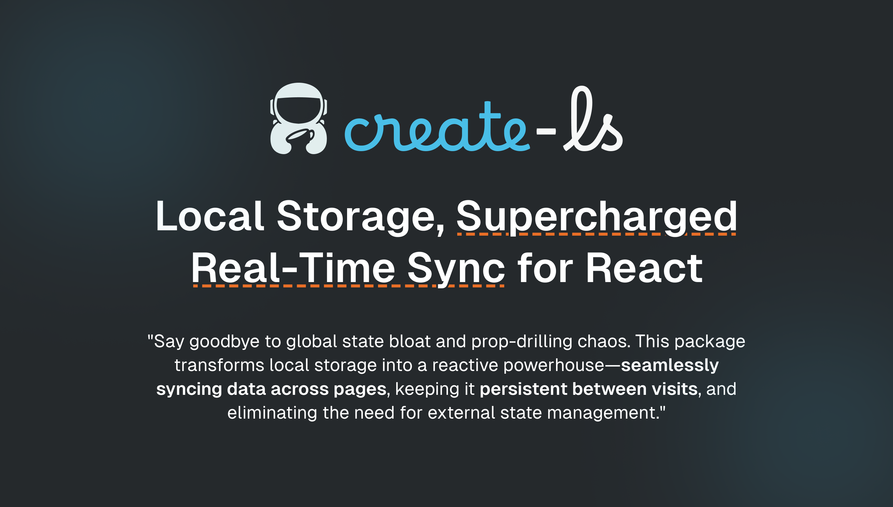

**Persistent, Real-Time Storage for React – No State Management Needed** Automatically sync local storage across components, tabs, and sessions with ease.

[](https://www.npmjs.com/package/create-ls)
[](LICENSE)
[](https://github.com/jp-coffee/create-ls/actions)
[](https://github.com/jp-coffee/create-ls/actions)

## 🚀 Features

- 🔄 **Real-time Sync** – Watch and react to local storage changes instantly across components.
- 💾 **Persistent State** – Data remains intact across page reloads and sessions.
- ⚡ **Lightweight & Fast** – No dependencies, minimal overhead.
- 🛠 **Simple API** – Get, set, and reset to changes effortlessly.
- 📡 **Cross-Tab Communication** – Sync updates across different tabs/windows.
- 🚫 **No External State Management** – Eliminate the need for Redux, Context API, or Zustand.

## 📦 Getting Started

### Installation

Install via your preferred package manager:

```sh
# npm
npm install ls-state

# yarn
yarn add ls-state

# pnpm
pnpm add ls-state

# bun
bun add ls-state
```

### Basic Usage

```tsx
"use client";

import { createLS } from "ls-state";

const Page: React.FC = () => {
  const counter = createLS("count", 0);

  return (
    <div>
      <h1>Count: {counter.get()}</h1>
      <button onClick={() => counter.set(counter.get() + 1)}>
        Increment by 1
      </button>
    </div>
  );
};

export default Page;
```

## 🔍 API Reference

### `createLS<T>(key: string, initialValue?: T)`

A React hook for reading and updating local storage with real-time sync.

#### Parameters

- `key` (string): The key under which the value is stored in local storage.
- `initialValue` (T, optional): The initial value to set if the key does not exist in local storage.
  If not provided, the value will be an empty string if the key does not exist.

#### Returns

- An object with the following properties:
  - `get`: A function to retrieve the current value from local storage.
  - `set`: A function to update the value in local storage and trigger re-renders.
  - `reset`: A function to reset the value in local storage to the initial value.
  - `hasValue`: A boolean indicating whether the key exists in local storage.

### `get()`

A function to retrieve the current value from local storage.

**Returns**

- The current value stored in local storage for the specified key.

### `set(value: T)`

A function to update the value in local storage and trigger re-renders.

**Parameters**

- `value` (T): The new value to set in local storage.

**Returns**

- `void`

### `reset()`

A function to reset the value in local storage to the initial value.

**Returns**

- `void`

### `hasValue()`

A boolean indicating whether the key exists in local storage.

**Returns**

- `boolean`: `true` if the key exists in local storage, `false` otherwise.

## 💡 Examples

### Using all methods

```tsx
"use client";

import { createLS } from "ls-state";

const Page: React.FC = () => {
  const counter = createLS("count", 0);

  return (
    <div>
      {counter.hasValue() ? (
        <h1>Count: {counter.get()}</h1>
      ) : (
        <h1>Click the button to set the count</h1>
      )}
      <button onClick={() => counter.set(counter.get() + 1)}>
        Increment by 1
      </button>
      <button onClick={() => counter.reset()}>Reset Count</button>
    </div>
  );
};

export default Page;
```

### Using Multiple Local Storage Keys

```tsx
"use client";

import { createLS } from "ls-state";

const Page: React.FC = () => {
  const counter1 = createLS("count1", 0);
  const counter2 = createLS("count2", 0);

  return (
    <div>
      <h1>Count 1: {counter1.get()}</h1>
      <h1>Count 2: {counter2.get()}</h1>
      <button onClick={() => counter1.set(counter1.get() + 1)}>
        Increment Count 1 by 1
      </button>
      <button onClick={() => counter2.set(counter2.get() + 1)}>
        Increment Count 2 by 1
      </button>
    </div>
  );
};

export default Page;
```

## 🛠 Contributing

Contributions are welcome! To contribute:

1. Fork the repository.
2. Create a feature branch.
3. Commit your changes.
4. Open a Pull Request.

## 📜 License

This project is licensed under the MIT License - see the [LICENSE](LICENSE) file for details.

---

## 👨‍💻 Created By

This package is developed and maintained by [JP.Coffee](https://github.com/jp-coffee). Feel free to reach out or open an issue for any questions or suggestions!
